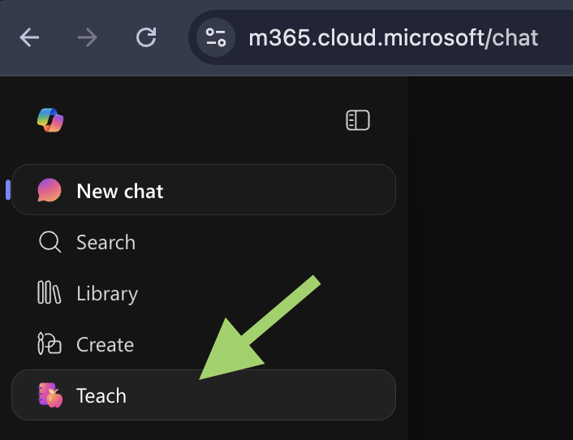
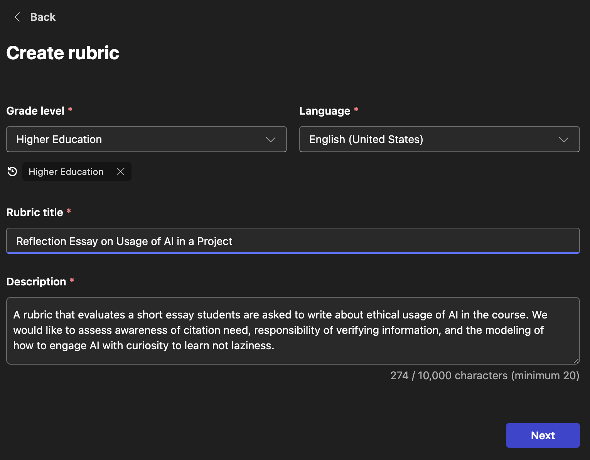
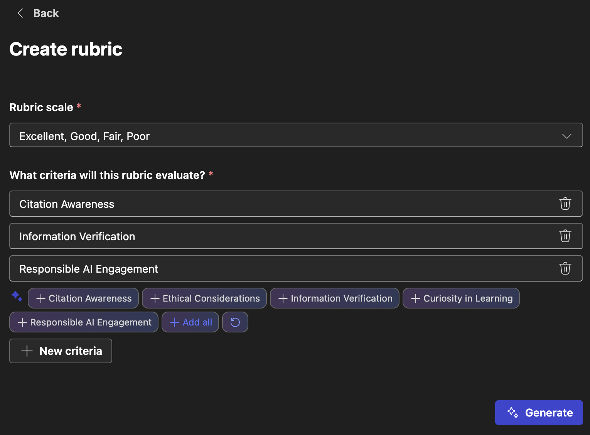
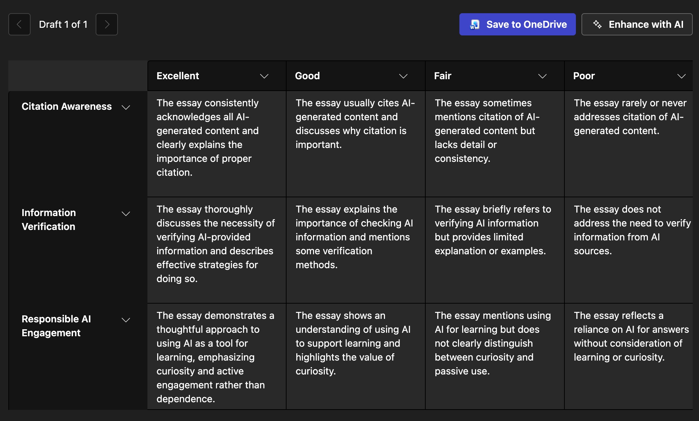

# Copilot365 Teaching Tools

_Last Updated: April 2026_

|Applications| UNC Supported | Cost | Time to Setup | Shortcut | FERPA Data |
|---|---------------|------|------|---------------|-----------------|
| Lesson Planning Rubrics  |Yes | Free | < 1 minute | [m365.cloud.microsoft/teach](https://m365.cloud.microsoft/teach) | [Yes](data-privacy.md){ title="Approved for FERPA and sensitive student data." } |

UNC's Microsoft Copilot 365 subscription offers **Teaching Tools** for instructors.

You can find them in the sidebar under **Teach** or by following this direct link: <https://m365.cloud.microsoft/teach/>

!!! info "Copilot 365 and FERPA Data Protection"

    For the teaching workflows covered in this toolkit, Copilot 365 is the general-purpose AI environment documented for FERPA-protected education records such as student grades. UNC's Microsoft agreement supports [UNC Tier 1 (Business Information)](https://policies.unc.edu/TDClient/2833/Portal/KB/Article/131244/Information-Classification-Standard) and [Tier 2 (Confidential Information)](https://policies.unc.edu/TDClient/2833/Portal/KB/Article/131244/Information-Classification-Standard) data. Use the UNC Microsoft 365 environment, not a personal consumer AI account, when a prompt or upload includes confidential student records.

### Lesson Plan Creator

Brainstorm and iterate on a structured lesson plan by filling in a simple form with the following fields. This is a useful tool for finding new ideas for lessons that need refreshing or sanity checking a new lesson you are working on.

* Subject
* Grade Level: Higher Education
* Description: Learning and content scope of the lecture (10,000 character limit)
* Optional file attachments
* Duration (free text customizable to 50 minutes)

  <iframe 
    src="https://www.youtube.com/embed/Cqby21PX9IU" 
    title="Generating Reading Questions with AI"
    frameborder="0" 
    allow="accelerometer; autoplay; clipboard-write; encrypted-media; gyroscope; picture-in-picture; web-share" 
    allowfullscreen>
  </iframe>

The tool generates a structured document broken down into timed segments. You can edit the draft directly or enhance it with AI by changing _tone_, _length_, or providing custom instructions. You can go back to earlier drafts at any time.

When you are satisfied with a draft, in one click you an save it to your OneDrive as a Word document that is easily exported to PDF or further edited.

!!! success "60-second Idea: Bring Active Learning to a Lecture"

    Do you have a lecture you would like to add active learning to? Try uploading your current slide deck and a simple description prompt along the lines of, "I would like to iterate on my attached lecture to meet the same learning objectives but with additional moments of active learning exercises added in. Let's brainstorm."

### Rubric Creator

It is common for grading to be delayed by being stuck on the "rubric block" of crafting a fair rubric for an assignment. Copilot 365's Rubric Creator can help you brainstorm a starting point for a rubric. 

**Step 1. Information about the Assignment**

**Step 2. Rubric Scale and Evaluation Criteria**

**Step 3. Rubric Generation**

**Step 4. Edit and Export**

You can manually edit individual blocks, add and remove rows and columns, or further regenerate with AI. Once you are satisfied with the rubric, you can export it as a Word document to your UNC OneDrive for further editing or printing.
